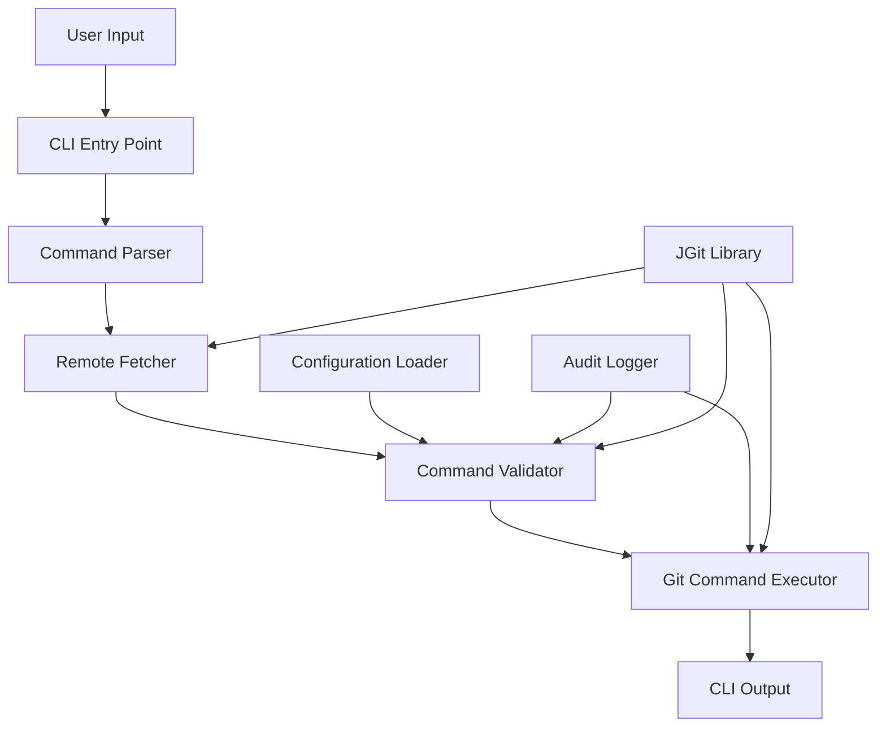

# Design Document: Safe Git CLI

## Overview

Safe Git CLI is a pure Java command-line tool that wraps Git operations with comprehensive safety validation. The system architecture follows a pipeline pattern: Command Parsing → Remote Fetching → Validation → Execution. Built using JGit library for Git operations, the tool provides a defensive layer that prevents destructive operations, validates repository state, and ensures safe Git workflows.

### Key Design Goals

1. **Safety First**: Block dangerous operations at the system level, not through warnings
2. **Pure Java Implementation**: Use JGit for Git operations, avoiding native Git command execution where possible
3. **Extensible Validation**: Plugin-based validation system for easy rule addition
4. **Clear User Feedback**: Detailed error messages with suggested alternatives
5. **Audit Trail**: Complete logging of all operations and validation decisions

### Technology Stack

- **Language**: Java 17+
- **Git Library**: JGit 6.x
- **CLI Framework**: picocli 4.x (for command-line parsing and help generation)
- **Logging**: SLF4J with Logback
- **Build Tool**: Maven
- **Testing**: JUnit 5, JUnit QuickCheck (for property-based testing)

## Architecture

### High-Level Architecture



### Component Architecture

The system is organized into the following layers:

1. **CLI Layer**: User interaction and command parsing
2. **Domain Layer**: Core business logic and validation rules
3. **Git Integration Layer**: JGit wrapper and Git operations
4. **Infrastructure Layer**: Configuration, logging, and utilities

### Package Structure

```
com.supergit/
├── cli/
│   ├── SafeGitCLI.java              # Main entry point
│   ├── CommandRegistry.java          # Available commands
│   └── OutputFormatter.java          # Console output formatting
├── command/
│   ├── Command.java                  # Command interface
│   ├── CommandContext.java           # Execution context
│   ├── parser/
│   │   ├── CommandParser.java        # Parse user input
│   │   └── GitCommandParser.java     # Git-specific parsing
│   └── impl/
│       ├── StatusCommand.java        # git status
│       ├── CommitCommand.java        # git commit
│       ├── PushCommand.java          # git push
│       ├── PullCommand.java          # git pull
│       ├── BranchCommand.java        # git branch
│       └── ResetCommand.java         # git reset
├── validation/
│   ├── ValidationEngine.java         # Orchestrates validation
│   ├── ValidationRule.java           # Rule interface
│   ├── ValidationResult.java         # Rule execution result
│   ├── rules/
│   │   ├── ForcePushRule.java
│   │   ├── HardResetRule.java
│   │   ├── UnmergedBranchDeleteRule.java
│   │   ├── RebaseSharedBranchRule.java
│   │   ├── AmendPushedCommitRule.java
│   │   ├── DivergentBranchRule.java
│   │   └── WorkingTreeCleanRule.java
│   └── RuleRegistry.java             # Rule management
├── git/
│   ├── GitRepository.java            # Repository abstraction
│   ├── GitOperations.java            # Git operation wrapper
│   ├── RemoteFetcher.java            # Auto-fetch logic
│   ├── RepositoryState.java          # Current repo state
│   └── BranchAnalyzer.java           # Branch comparison logic
├── config/
│   ├── Configuration.java            # Config model
│   ├── ConfigurationLoader.java      # Load .safegitrc
│   └── DefaultConfiguration.java     # Default settings
├── logging/
│   ├── AuditLogger.java              # Audit log operations
│   └── LogRotation.java              # Log file rotation
└── util/
    ├── ProcessExecutor.java          # Safe process execution
    └── ExitCode.java                 # Exit code constants
```

## Components and Interfaces

### 1. CLI Entry Point

**SafeGitCLI.java**
```java
@Command(name = "safegit", mixinStandardHelpOptions = true)
public class SafeGitCLI implements Callable<Integer> {
    @Parameters(index = "0", description = "Git command to execute")
    private String command;
    
    @Parameters(index = "1..*", description = "Command arguments")
    private List<String> args;
    
    public Integer call() {
        // Main execution pipeline
    }
}
```

**Responsibilities**:
- Parse command-line arguments using picocli
- Initialize application context (config, logging, Git repository)
- Orchestrate the execution pipeline
- Format and display output
- Return appropriate exit codes

### 2. Command Parser

**CommandParser Interface**
```java
public interface CommandParser {
    ParsedCommand parse(String command, List<String> args);
}

public class ParsedCommand {
    private final CommandType type;
    private final Map<String, String> options;
    private final List<String> arguments;
    private final OperationCategory category; // READ, WRITE, DESTRUCTIVE
}
```

**Responsibilities**:
- Parse user input into structured command objects
- Identify command type and category
- Extract options and arguments
- Validate command syntax

### 3. Remote Fetcher

**RemoteFetcher.java**
```java
public class RemoteFetcher {
    private final GitRepository repository;
    private final AuditLogger logger;
    
    public FetchResult fetchIfRemoteExists() {
        if (!repository.hasRemote()) {
            return FetchResult.noRemote();
        }
        
        try {
            FetchResult result = repository.fetch();
            logger.logFetch(result);
            return result;
        } catch (GitAPIException e) {
            return FetchResult.failed(e);
        }
    }
}

public class FetchResult {
    private final boolean executed;
    private final boolean successful;
    private final String message;
    private final Optional<Exception> error;
}
```

**Responsibilities**:
- Check for remote repository configuration
- Execute git fetch before operations
- Handle fetch failures
- Log fetch results

### 4. Validation Engine

**ValidationEngine.java**
```java
public class ValidationEngine {
    private final RuleRegistry ruleRegistry;
    private final Configuration config;
    private final AuditLogger logger;
    
    public ValidationResult validate(CommandContext context) {
        List<ValidationRule> applicableRules = 
            ruleRegistry.getRulesForCommand(context.getCommand());
        
        for (ValidationRule rule : applicableRules) {
            if (!config.isRuleEnabled(rule.getName())) {
                continue;
            }
            
            RuleResult result = rule.evaluate(context);
            logger.logValidation(rule, result);
            
            if (result.isBlocking()) {
                return ValidationResult.blocked(rule, result);
            }
        }
        
        return ValidationResult.passed();
    }
}
```

**ValidationRule Interface**
```java
public interface ValidationRule {
    String getName();
    String getDescription();
    RuleResult evaluate(CommandContext context);
    List<CommandType> getApplicableCommands();
}

public class RuleResult {
    private final boolean passed;
    private final Severity severity; // INFO, WARNING, BLOCKING
    private final String message;
    private final List<String> suggestedActions;
}
```

**Responsibilities**:
- Orchestrate validation rule execution
- Apply configuration to enable/disable rules
- Aggregate validation results
- Log all validation decisions

### 5. Validation Rules

Each validation rule implements the `ValidationRule` interface. Key rules include:

**ForcePushRule.java**
- Detects force push attempts (`--force`, `-f`)
- Checks if target branch has remote commits not present locally
- Requires explicit confirmation for force pushes
- Displays commits that would be lost

**HardResetRule.java**
- Detects hard reset commands (`reset --hard`)
- Checks for uncommitted changes in working directory
- Blocks reset if uncommitted changes exist
- Lists affected files

**UnmergedBranchDeleteRule.java**
- Detects branch deletion attempts
- Verifies branch is fully merged to current branch
- Displays unmerged commits
- Suggests merge before deletion

**RebaseSharedBranchRule.java**
- Detects rebase operations on shared branches
- Checks if commits have been pushed to remote
- Blocks rebase of pushed commits
- Suggests alternatives (merge, pull --rebase)

**AmendPushedCommitRule.java**
- Detects commit amend operations
- Checks if HEAD commit has been pushed
- Blocks amend of pushed commits
- Explains history rewriting implications

**DivergentBranchRule.java**
- Detects diverged branches before push
- Compares local and remote branch states
- Shows ahead/behind commit counts
- Suggests pull before push

**WorkingTreeCleanRule.java**
- Verifies working directory is clean when required
- Checks for uncommitted changes
- Checks for untracked files (when relevant)
- Applies to: checkout, rebase, merge, pull

### 6. Git Repository Abstraction

**GitRepository.java**
```java
public class GitRepository {
    private final Repository jgitRepo;
    private final Git git;
    
    public RepositoryState getState() {
        return RepositoryState.builder()
            .hasRemote(hasRemote())
            .currentBranch(getCurrentBranch())
            .hasUncommittedChanges(hasUncommittedChanges())
            .hasConflicts(hasConflicts())
            .isDetachedHead(isDetachedHead())
            .build();
    }
    
    public BranchComparison compareBranches(String local, String remote) {
        // Use JGit to compare commit histories
    }
    
    public List<Commit> getUnpushedCommits(String branch) {
        // Use JGit RevWalk to find unpushed commits
    }
    
    public boolean hasRemote() {
        return !jgitRepo.getRemoteNames().isEmpty();
    }
}
```

**Responsibilities**:
- Wrap JGit Repository and Git objects
- Provide high-level Git operations
- Query repository state
- Perform branch analysis
- Execute Git commands safely

### 7. Command Executor

**GitCommandExecutor.java**
```java
public class GitCommandExecutor {
    private final GitRepository repository;
    private final AuditLogger logger;
    
    public ExecutionResult execute(CommandContext context) {
        Command command = context.getCommand();
        
        try {
            logger.logExecutionStart(command);
            
            Object result = command.execute(repository);
            
            logger.logExecutionSuccess(command, result);
            return ExecutionResult.success(result);
            
        } catch (Exception e) {
            logger.logExecutionFailure(command, e);
            return ExecutionResult.failure(e);
        }
    }
}
```

**Responsibilities**:
- Execute validated commands
- Handle execution errors
- Log execution results
- Format command output

### 8. Configuration System

**Configuration.java**
```java
public class Configuration {
    private final Map<String, Boolean> enabledRules;
    private final int maxLogSizeMB;
    private final boolean verboseLogging;
    private final int commandTimeoutSeconds;
    
    public boolean isRuleEnabled(String ruleName) {
        return enabledRules.getOrDefault(ruleName, true);
    }
}
```

**.safegitrc Format** (YAML)
```yaml
validation:
  force_push: true
  hard_reset: true
  unmerged_branch_delete: true
  rebase_shared_branch: true
  amend_pushed_commit: true
  divergent_branch: true
  working_tree_clean: true

logging:
  max_log_size_mb: 10
  verbose: false

execution:
  command_timeout_seconds: 60
```

**Responsibilities**:
- Load configuration from .safegitrc
- Provide default configuration
- Validate configuration values
- Make configuration accessible to all components

### 9. Audit Logger

**AuditLogger.java**
```java
public class AuditLogger {
    private final Path logFile;
    private final LogRotation rotator;
    
    public void logCommand(String command, List<String> args) {
        write(String.format("[%s] COMMAND: %s %s", 
            timestamp(), command, String.join(" ", args)));
    }
    
    public void logValidation(ValidationRule rule, RuleResult result) {
        write(String.format("[%s] VALIDATION: %s = %s (%s)", 
            timestamp(), rule.getName(), result.isPassed(), result.getMessage()));
    }
    
    public void logBlocked(ValidationRule rule, RuleResult result) {
        write(String.format("[%s] BLOCKED: %s - %s", 
            timestamp(), rule.getName(), result.getMessage()));
    }
}
```

**Log Format**
```
[2024-01-15T10:30:45] COMMAND: push origin main
[2024-01-15T10:30:45] FETCH: origin -> 3 new commits
[2024-01-15T10:30:45] VALIDATION: divergent_branch = FAILED (remote has 3 commits not present locally)
[2024-01-15T10:30:45] BLOCKED: divergent_branch - Cannot push to diverged branch
```

**Responsibilities**:
- Write all operations to log file
- Rotate logs when size exceeds threshold
- Provide structured log format
- Include timestamps and context

## Data Models

### CommandContext
```java
public class CommandContext {
    private final ParsedCommand parsedCommand;
    private final GitRepository repository;
    private final RepositoryState state;
    private final Configuration config;
    private final FetchResult fetchResult;
}
```

### RepositoryState
```java
public class RepositoryState {
    private final boolean hasRemote;
    private final String currentBranch;
    private final boolean hasUncommittedChanges;
    private final boolean hasConflicts;
    private final boolean isDetachedHead;
    private final List<String> modifiedFiles;
    private final List<String> untrackedFiles;
}
```

### BranchComparison
```java
public class BranchComparison {
    private final String localBranch;
    private final String remoteBranch;
    private final int commitsAhead;
    private final int commitsBehind;
    private final List<Commit> aheadCommits;
    private final List<Commit> behindCommits;
    private final boolean diverged;
}
```

### ValidationResult
```java
public class ValidationResult {
    private final boolean passed;
    private final Optional<ValidationRule> failedRule;
    private final Optional<RuleResult> failureDetails;
    private final List<String> warnings;
}
```

### ExecutionResult
```java
public class ExecutionResult {
    private final boolean successful;
    private final Optional<Object> result;
    private final Optional<Exception> error;
    private final String output;
    private final int exitCode;
}
```

## Error Handling

### Error Categories

1. **User Input Errors**
   - Invalid command syntax
   - Unknown command
   - Missing required arguments
   - Action: Display usage help, suggest correct syntax

2. **Repository State Errors**
   - Not a Git repository
   - Repository corruption detected
   - Merge conflicts present
   - Action: Display current state, suggest resolution steps

3. **Validation Errors**
   - Dangerous operation blocked
   - Preconditions not met
   - Action: Explain why blocked, suggest safe alternatives

4. **Git Operation Errors**
   - JGit exceptions
   - Network failures (fetch/push)
   - Authentication failures
   - Action: Display error details, suggest troubleshooting

5. **System Errors**
   - Configuration load failure
   - Log write failure
   - Unexpected exceptions
   - Action: Use defaults, log to stderr, continue if possible

### Error Response Format

```java
public class ErrorResponse {
    private final String errorCode;
    private final String title;
    private final String description;
    private final List<String> suggestedActions;
    private final Optional<String> detailedMessage;
}
```

**Console Output Example**
```
ERROR: Force push blocked (FORCE_PUSH_001)

Cannot force push to branch 'main' because it would overwrite remote commits.

Remote commits that would be lost:
  abc1234 - Update README.md (2 hours ago)
  def5678 - Fix typo in documentation (1 day ago)

Suggested actions:
  1. Pull the latest changes: safegit pull origin main
  2. Resolve any conflicts and push normally: safegit push origin main
  3. If you are certain, use force-with-lease: git push --force-with-lease
```

## Testing Strategy

The Safe Git CLI requires a comprehensive testing strategy that combines unit tests for specific scenarios with property-based tests for universal correctness properties.

### Unit Testing

Unit tests will cover:

1. **Command Parsing**
   - Valid command syntax parsing
   - Invalid syntax error handling
   - Edge cases: empty input, special characters, long arguments

2. **Specific Validation Scenarios**
   - Force push with diverged branches
   - Hard reset with uncommitted changes
   - Branch deletion of unmerged branch
   - Rebase of pushed commits

3. **Git Operations**
   - Repository state queries
   - Branch comparison logic
   - Commit history analysis

4. **Configuration Loading**
   - Valid .safegitrc parsing
   - Invalid configuration handling
   - Default configuration application

5. **Integration Tests**
   - End-to-end command execution
   - Real Git repository operations (using JGit in-memory repositories)
   - Validation rule integration

### Property-Based Testing

Property-based tests will verify universal correctness properties using **JUnit QuickCheck**, configured to run **100 iterations minimum** per property.

The testing library for Java will be:
- **JUnit QuickCheck**: Java property-based testing library that integrates with JUnit 5

Each property test will be tagged with a comment referencing the design property:
```java
// Feature: safe-git-cli, Property 1: Command parsing round trip
@Property(trials = 100)
public void testCommandParsingRoundTrip(...) { }
```

Property tests will focus on:
- Command parsing invariants
- Validation rule consistency
- State transition correctness
- Git operation safety guarantees

Both unit tests and property-based tests are necessary for comprehensive coverage. Unit tests catch specific bugs and edge cases, while property-based tests verify that universal correctness guarantees hold across a wide range of inputs.

